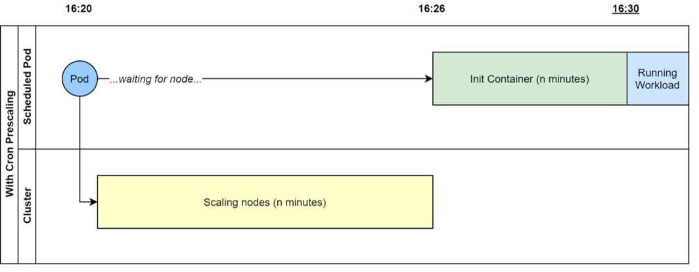

-- update to trigger build --

# Project Status & Disclaimer
The code provided in this repo is not actively maintained.  


# Introduction 
The main purpose of this project is to provide a mechanism whereby cronjobs can be run on auto-scaling clusters, and ensure that the cluster is scaled up to their desired size prior to the time at which the `CronJob` workload needs to begin.

## Example
For a workload to start at *16:30* exactly, a node in the cluster has to be available and warm at that time. The `PrescaledCronJob` CRD and operator will ensure that a cronjob gets scheduled n minutes earlier to force the cluster to prepare a node, and then a custom init container will run, blocking the workload running until the correct time. 



## How it works
- This project defines a new Kubernetes CRD kind named `PreScaledCronJob`; and an Operator that will reconcile said kind.
- When a `PreScaledCronJob` is created in a cluster, this Operator will create an associated `CronJob` object that will execute X minutes prior to the real workload and ensure any necessary agent pool machines are "warmed up".
   - More information on how we calculate the `CronJob` schedule can be found in [the Primed Cronjob Schedules
 documentation here](docs/cronjobs.md)
- The created `CronJob` is associated to the `PreScaledCronJob` using the Kubernetes `OwnerReference` mechanism. Thus enabling us to automatically delete the `CronJob` when the `PreScaledCronJob` resource is deleted. For more information please check out the [Kubernetes documentation here](https://kubernetes.io/docs/concepts/workloads/controllers/garbage-collection/#owners-and-dependents)
- `PreScaledCronJob` objects can check for changes on their associated `CronJob` objects via a generated hash. If this hash does not match that which the `PreScaledCronJob` expects, we update the `CronJob` spec.
- The generated `CronJob` uses an `initContainer` spec to spin-wait thus warming up the agent pool and forcing it to scale up to our desired state ahead of the real workload. For more information please check out the [Init Container documentation here](https://kubernetes.io/docs/concepts/workloads/pods/init-containers/)

# Getting Started
1. Clone the codebase
2. Ensure you have Docker installed and all necessary pre-requisites to develop on remote containers [installation notes](https://code.visualstudio.com/docs/remote/containers#_installation)
3. Install [VSCode Remote Development extensions pack](https://aka.ms/vscode-remote/download/extension)
4. Open the project and run in the development container

# Build And Deploy

**NOTE: In order to ensure a smooth deployment process, for both local and remote deployments, we recommend you use the dev container provided within this repo. This container provides you with all the assemblies and cli tools required to perform the actions below**

## Deploying locally

If you are using the development container you have the option of deploying the Operator into a local test Kubernetes Cluster provided by the [KIND toolset](https://github.com/kubernetes-sigs/kind)

To deploy to a local K8s/Kind instance:
  ```bash
  make deploy-kind
  ```

## Deploying to a remote cluster

### Prerequisites 
- Ensure your terminal is connected to your K8s cluster
- Ensure your terminal is logged into your docker container registry that you will be using as the image store for your K8s cluster
- Ensure your cluster has permissions to pull containers from your container registry

### Deploying

1. Deploy the image used to initialise cluster scale up:

```bash
  make docker-build-initcontainer docker-push-initcontainer INIT_IMG=<some-registry>/initcontainer:<tag>
```
2. Deploy the operator to your cluster:

  ```bash
    make docker-build docker-push IMG=<some-registry>/prescaledcronjoboperator:<tag> INIT_IMG=<some-registry>/initcontainer:<tag>

    make deploy-cluster IMG=<some-registry>/prescaledcronjoboperator:<tag> INIT_IMG=<some-registry>/initcontainer:<tag>
  ```

3. Once the deployment is complete you can check that everything is installed:

```
  kubectl get all -n psc-system
```

## Creating your first PreScaledCronJob
A sample `yaml` is provided for you in the config folder.

- To apply this: 
```
  kubectl apply -f config/samples/psc_v1alpha1_prescaledcronjob.yaml
```

- To test the Operator worked correctly:
```
  kubectl get prescaledcronjobs -A
  kubectl get cronjobs -A
```

- If everything worked correctly you should see the following output:
```
NAMESPACE    NAME                      AGE
psc-system   prescaledcronjob-sample   30s

NAMESPACE    NAME                              SCHEDULE        SUSPEND   ACTIVE   LAST SCHEDULE   AGE
psc-system   autogen-prescaledcronjob-sample   45,15 * * * *   False     0        <none>          39s
```

If you do not see the ouput above then please review the [debugging documentation](docs/debugging.md). Deleting the `PrescaledCronJob` resource will clean up the `CronJob` automatically.

###  Define Primer Schedule
Before the actual cronjob kicks off, an init container pre-warms the cluster so all nodes are immediately available when the cronjob is intended to run.

There are two ways to define this primer schedule:
1. Set `warmUpTimeMins` under the PreScaledCronJob spec. This will [generate](docs/cronjobs.md) a primed cronjob schedule based on your original schedule and the amount of minutes you want to pre-warm your cluster. This can be defined as follows (An example yaml is provided in `config/samples/psc_v1alpha1_prescaledcronjob.yaml`):
```
kind: PreScaledCronJob
spec:
  warmUpTimeMins: 5
  cronJob:
    spec:
      schedule: "5/30 * * * *"
```
- OR -
2. Set a pre-defined `primerSchedule` under the PreScaledCronJob. The pre-defined primer schedule below results in the exact same pre-warming and cron schedule as the schedule above. (An example yaml is provided in `config/samples/psc_v1alpha1_prescaledcronjob_primerschedule.yaml`)
```
kind: PreScaledCronJob
spec:
  primerSchedule: "*/30 * * * *"
  cronJob:
    spec:
      schedule: "5/30 * * * *"
```


# Debugging

Please review the [debugging documentation](docs/debugging.md)

# Monitoring

Please review the [monitoring documentation](docs/monitoring.md)

# Running the Tests
This repo contains 3 types of tests, which are logically separated:
- Unit tests, run with `go test`.
  - To run: `make unit-tests`.
- 'Local' Integration tests, which run in a KIND cluster and test that the operator outputs the objects we expect.
  - To run: `make kind-tests` 
- 'Long' Integration tests, also running in KIND which submit objects to the cluster and monitor the cluster to ensure jobs start at the right time.
  - To run: `make kind-long-tests` 


# Hints and Tips
- Run `make fmt` to automatically format your code

# Kustomize patching
Many samples in the Kubernetes docs show `requests` and `limits` of a container using plain integer values, such as:
```yaml
requests:
  nvidia.com/gpu: 1
```
The generated yaml schema definition for the `PrescaledCronJob` just sets the validation for these properties to `string`s, rather than what they should be (`integer` | `string` with a fixed regex format). This means we need to apply a patch (`/config/crd/patches/resource-type-patch.yaml`) to override the autogenerated type. This information may come in handy in future if other edge cases are found. 
